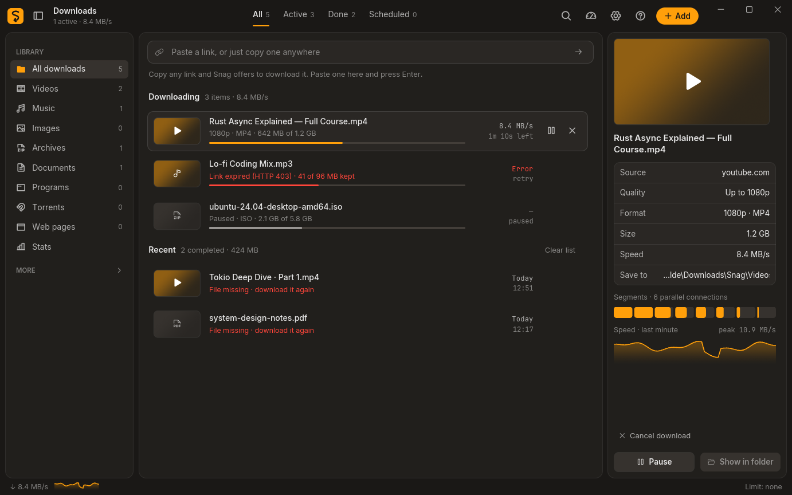
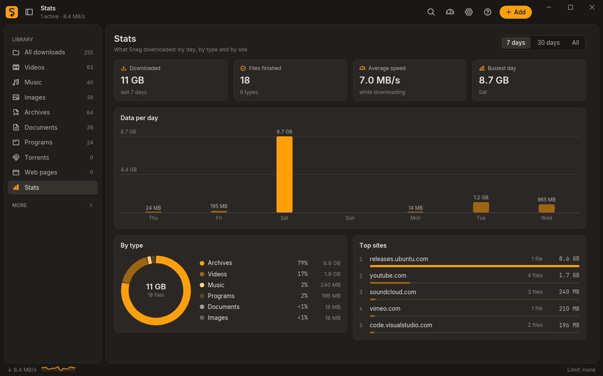
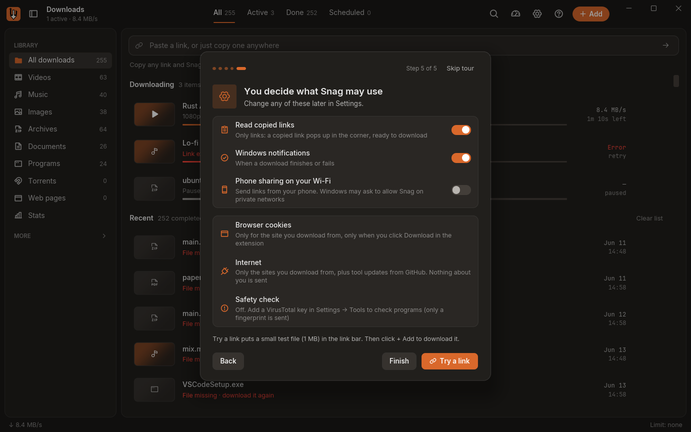

# Snag

**A fast, free download manager for Windows**, with a browser extension that catches videos the way IDM does. Written in Rust.

**Website:** [snag.kuldeepsaini.dev](https://snag.kuldeepsaini.dev) · **Download:** [Snag-Setup.exe](https://github.com/kuldeepsaini23/snag/releases/latest/download/Snag-Setup.exe) · [Privacy](https://snag.kuldeepsaini.dev/privacy)



## What it does

- **Fast downloads.** Big files come down over up to 8 connections at once, and pause and resume where they stopped, even after a restart or a crash.
- **Videos and music from 1,800+ sites** (YouTube and many more) through [yt-dlp](https://github.com/yt-dlp/yt-dlp): pick 1080p, 720p or MP3, whole playlists, subtitles, live recordings.
- **Catches what's playing.** The extension sees the video stream a page's player loads and hands it to Snag, so downloads start instantly, even on sites yt-dlp doesn't know.
- **Pictures, torrents and pages.** Image galleries (Pinterest, Imgur, Reddit, Instagram and X posts), magnet links and .torrent files, and whole web pages saved as one offline file.
- **Rules after download.** Convert to MP3, shrink videos, unpack archives or move files, by type, site or category.
- **Safety check.** Look up downloaded programs on VirusTotal with your own free key; only the file's SHA-256 fingerprint is sent.
- **Around the app.** Clipboard watch, queues and schedules, a speed limit, send links from your phone, watched channels, stats, light and dark themes, any accent colour.



## Install

**Windows 10 and 11.** Download [`Snag-Setup.exe`](https://github.com/kuldeepsaini23/snag/releases/latest/download/Snag-Setup.exe) from the [latest release](https://github.com/kuldeepsaini23/snag/releases/latest) (about 12 MB) and run it. It installs for your user only, so no admin rights are needed.

**macOS 11 and later (Apple silicon and Intel).** Download [`Snag-macOS.dmg`](https://github.com/kuldeepsaini23/snag/releases/latest/download/Snag-macOS.dmg), open it and drag Snag to Applications. Snag isn't notarized by Apple yet, so the first time **right-click Snag → Open**, then **Open** again (on macOS 15 and later: open it once, then **System Settings → Privacy & Security → Open Anyway**). After that it starts normally, waits in the menu bar when its window is closed, and updates itself (`Snag-macOS.zip`) while it sits in a folder you can write to, like Applications. Settings are kept in `~/Library/Application Support/Snag`.

**Linux (x86_64).** Download [`Snag-x86_64.AppImage`](https://github.com/kuldeepsaini23/snag/releases/latest/download/Snag-x86_64.AppImage), make it executable (`chmod +x Snag-x86_64.AppImage`) and run it; it updates itself like the Windows version. On Debian and Ubuntu you can install `snag_<version>_amd64.deb` from the release instead (`sudo apt install ./snag_*_amd64.deb`); its update card links to the release page. Both need glibc 2.35 or newer (Ubuntu 22.04, Debian 12, Fedora 36 and later). The tray icon needs an AppIndicator host: KDE, Cinnamon, Xfce and Ubuntu's GNOME have one; on plain GNOME add the *AppIndicator and KStatusNotifierItem Support* extension. Settings are kept in `~/.local/share/snag`.

Windows may say "Windows protected your PC" because the installer isn't code-signed yet: click **More info → Run anyway**. Each release lists its SHA-256 checksums, so you can check the file is the one published here.

Snag fetches its helpers the first time they're needed: yt-dlp for video sites, gallery-dl for image galleries, and ffmpeg (35 MB, checked against its published checksum) for HD video, MP3 and conversions. On Linux an ffmpeg already installed (e.g. `apt install ffmpeg`) is used; otherwise a static build (about 150 MB) is fetched and checked the same way. On a Mac an ffmpeg from Homebrew is used, otherwise [Martin Riedl's](https://ffmpeg.martin-riedl.de) signed static build for your processor (checked the same way); gallery-dl has no Intel Mac build, so an Intel Mac needs `brew install gallery-dl` for image galleries.

Snag looks for a newer version on GitHub at start and every few hours, and offers it in a small card; **Update now** downloads it, checks it against the checksum published with the release, installs it and reopens Snag. You can switch this off in Settings → General.

### Build it yourself

1. Install [Rust](https://rustup.rs) (stable), [Node.js](https://nodejs.org) and, for the installer, [Inno Setup 6](https://jrsoftware.org/isdl.php).
2. `cargo build --release` builds `target\release\snag.exe`; `bash installer/build.sh` builds the installer and the extension packages.
3. Linux: install the packages listed at the top of `packaging/linux/build.sh` (GTK 3, AppIndicator, xdo), then `cargo build --release` builds `target/release/snag`; `bash packaging/linux/build.sh` builds the AppImage and the .deb.
4. macOS: with Xcode's command line tools and `rustup target add aarch64-apple-darwin x86_64-apple-darwin`, `bash packaging/macos/build.sh` builds a universal `Snag.app`, `Snag-macOS.zip` and `Snag-macOS.dmg` in `target/macos` (signed ad hoc, not notarized).

### Browser extension

Chrome, Edge, Brave and other Chromium browsers:

1. Open `chrome://extensions` (or `edge://extensions`, `brave://extensions`) and turn on **Developer mode**.
2. Click **Load unpacked** and pick the `browser-extension` folder in Snag's install folder (or `extension` in this repository). Store versions are on their way.
3. Click the Snag icon, then **Connect to Snag**, and press **Allow** in Snag.

Firefox: run `node extension/build.js` and load `extension/dist/firefox` from `about:debugging` → This Firefox → Load Temporary Add-on.

After updating the extension, reload it and press F5 on open tabs.

## Privacy



- Snag has no account, no analytics and no server of its own. Your downloads, settings and history stay in `%APPDATA%\Snag` on your PC.
- The extension talks only to Snag on your own computer (`127.0.0.1`), after you allow it once. It shares cookies only for the site you download from, and only when you send a download.
- Snag connects to the sites you download from, to GitHub for yt-dlp and gallery-dl updates, and to VirusTotal only if you add a key.
- Clipboard watch, notifications and phone sharing are your choice in the first-run tour and in Settings.
- **Report a bug** writes a text file on your Desktop for you to read and send. It leaves out your pairing code, cookies, keys and personal folder names.

## How it works

See the [architecture notes](docs/site/architecture.html) for diagrams. In short: a Rust workspace with an engine for segmented HTTP downloads, a core manager (queues, retries, rules), a media crate driving yt-dlp, gallery-dl and ffmpeg, torrents through librqbit, a local bridge for the extension, and an [iced](https://iced.rs) desktop app.

```
cargo test --workspace                   # 380+ tests
cargo clippy --workspace --all-targets
node --test extension/tests/*.js
```

## Please use it fairly

Download only what you have the right to download. Respect the terms of the sites you use and the work of the people who made it. Snag does not and will not break DRM (Netflix, Spotify and similar services).

## Credits

Snag stands on great open-source work: [yt-dlp](https://github.com/yt-dlp/yt-dlp) (Unlicense), [gallery-dl](https://github.com/mikf/gallery-dl) (GPL-2.0, downloaded at run time, not bundled), [FFmpeg](https://ffmpeg.org), [librqbit](https://github.com/ikatson/rqbit) (Apache-2.0), [monolith](https://github.com/Y2Z/monolith) (CC0), [iced](https://iced.rs) (MIT), [Phosphor icons](https://phosphoricons.com) (MIT), [Inter](https://rsms.me/inter/) and [JetBrains Mono](https://www.jetbrains.com/lp/mono/) (OFL).

## License

[MIT](LICENSE) © 2026 Kuldeep Saini
